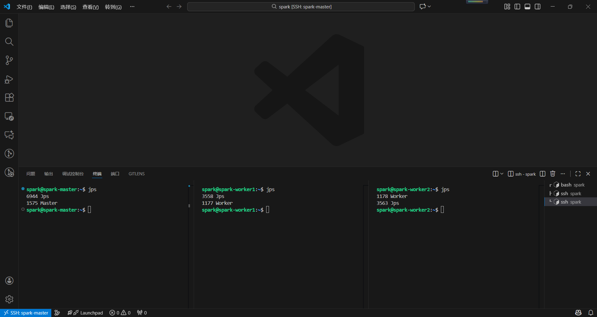
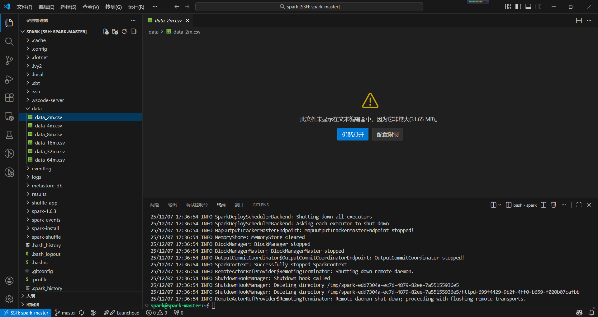
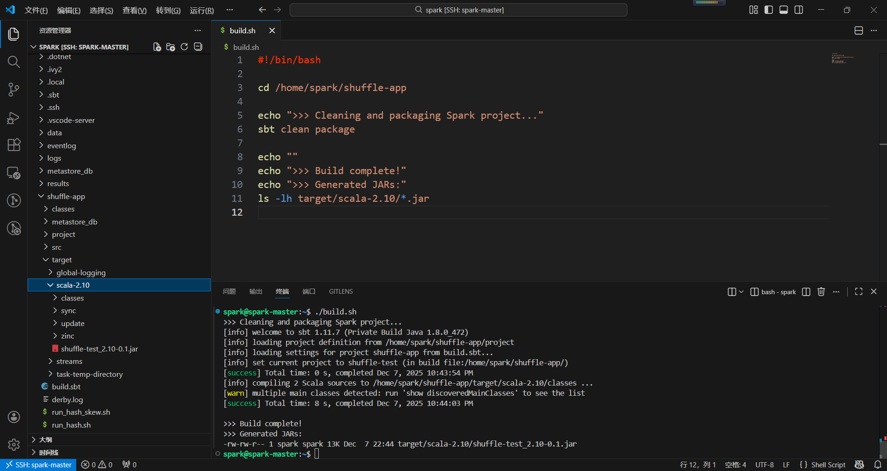
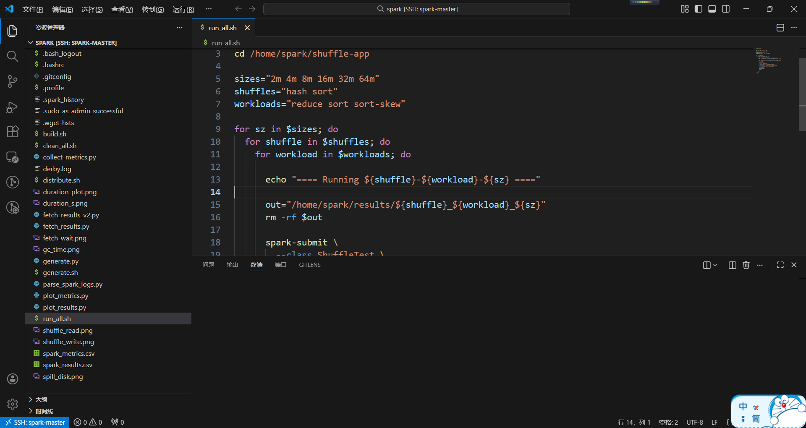
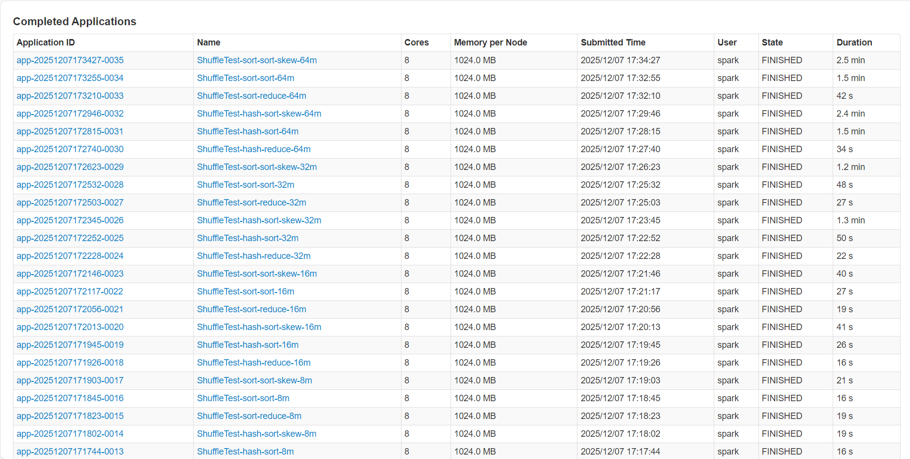
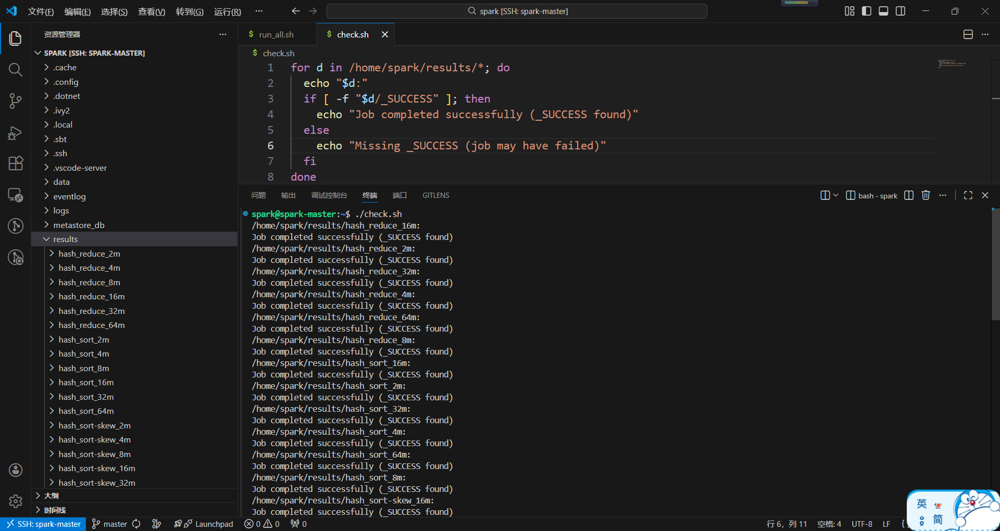
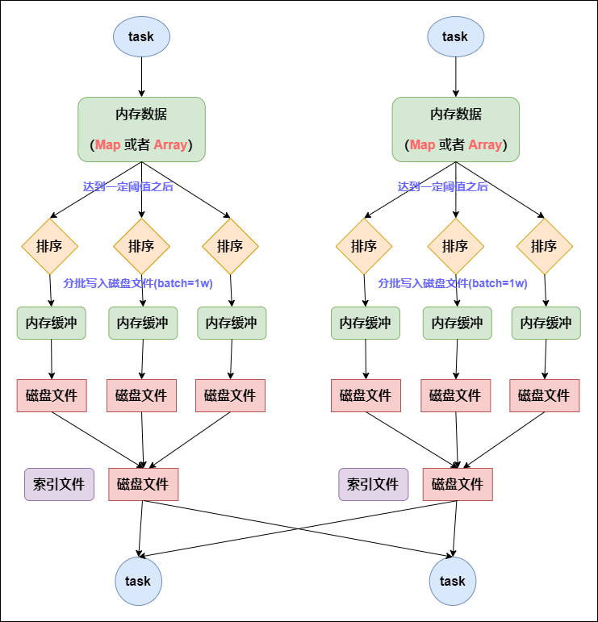
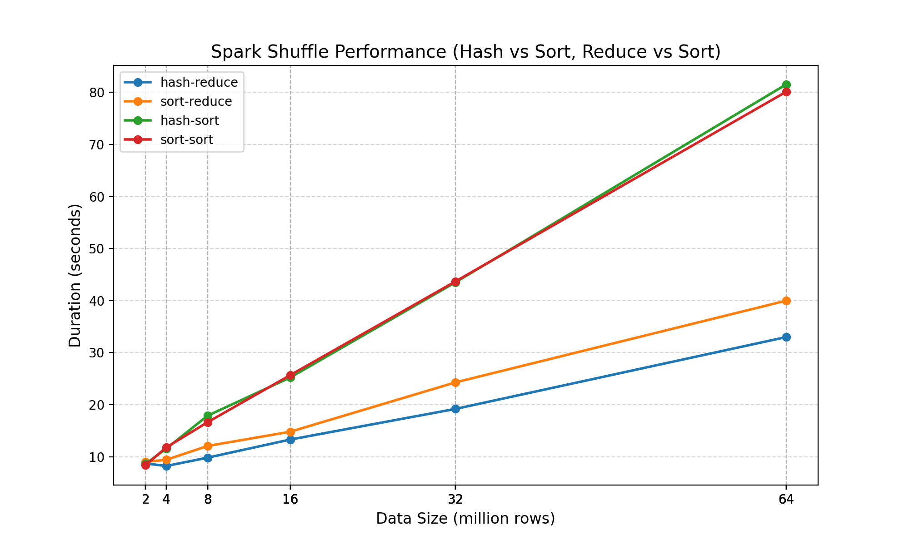
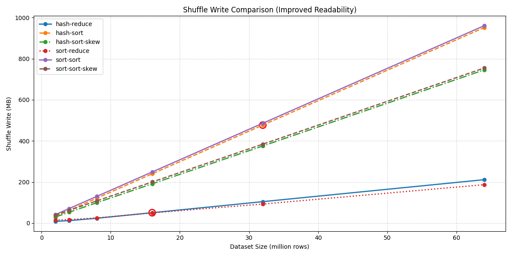

# Spark Shuffle算法比较

## 研究目的

比较Spark中的两种Shuffle算法：基于Hash和基于Sort。

## 研究内容

对比分析Spark中基于Hash和基于Sort的两种Shuffle算法的执行流程，探讨它们各自的优缺点及适用场景。

## 实验

### 实验环境

#### 1. 硬件环境

本实验采用火山引擎（Volcengine）ECS 集群，共包含三台实例（1 台 Master，2 台 Worker），均为 ecs.g3il.large 规格，配置如下：

**（1）计算资源**

- CPU：**2 vCPU**
- 内存：**8 GiB**

**（2）存储资源**

- 系统盘：**极速型 SSD PL0，20 GiB**
- 虽然虚拟机层 `lsblk` 显示 ROTA=1（旋转介质），但根据火山云配置，底层实际使用 SSD，因此磁盘 IO 延迟较低，有利于 Shuffle 阶段的磁盘读写性能。

**（3）网络配置**

- 外网带宽：**1 Mbps**（实例限速）
- 内网带宽：**约 1 Gbps**（火山云 VPC 虚拟交换机）
- Shuffle 过程中节点间通信主要通过内网完成，因此内网带宽对性能影响更为关键。

**（4）节点列表**

| 角色       | 实例类型           | CPU    | 内存    | 系统盘            | 操作系统         |
| -------- | -------------- | ------ | ----- | -------------- | ------------ |
| Master   | ecs.g3il.large | 2 vCPU | 8 GiB | SSD PL0 20 GiB | Ubuntu 22.04 |
| Worker 1 | ecs.g3il.large | 2 vCPU | 8 GiB | SSD PL0 20 GiB | Ubuntu 22.04 |
| Worker 2 | ecs.g3il.large | 2 vCPU | 8 GiB | SSD PL0 20 GiB | Ubuntu 22.04 |

---

#### 2. 软件环境

**（1）操作系统**

- Ubuntu **22.04.4 LTS**

**（2）Java 环境**

- OpenJDK **1.8.0_472**

**（3）Spark 版本**

- Spark **1.6.3** (Standalone 模式)

**（4）Python 环境**

- Python **3.10.12**

---

#### 3. 节点角色与服务分布

| 节点 IP      | 主机名          | 角色     | 运行服务            |
| ---------- | ------------      | ------ | --------------- |
| 172.31.0.2 | spark-master      | Master | Master |
| 172.31.0.3 | spark-worker1     | Worker | Worker          |
| 172.31.0.4 | spark-worker2     | Worker | Worker          |

---

#### 4. Spark 资源配置

| 项目            | 数值      |
| ------------- | ------- |
| Worker CPU 核数 | 2 cores |
| Worker 内存     | 4 GB    |
| Shuffle 服务端口  | 7337    |
| Spark UI 端口   | 8080    |

### 实验负载

#### 1. 数据集说明

本实验采用自定义脚本生成结构化 CSV 数据集，每条记录由三列整数组成：

```
id,rand1,rand2
```

其中：

- `id`: 从 0 递增，可作为排序场景的 key；
- `rand1`: 0～1,000,000 的均匀随机整数，主要用于 reduce 工作负载；
- `rand2`: 被人为构造为高度倾斜，用于验证 Spark Shuffle 在数据倾斜场景下的行为。

这样设计的目的是：

- 普通负载（reduce / sort）可在无倾斜干扰下对比 Hash 与 Sort Shuffle 的差异；
- 倾斜负载可观测 Hash Shuffle 的退化现象，以及 Sort Shuffle 在倾斜下的性能变化。

根据实验需求，生成了六个不同规模的数据集，分别包含 2M、4M、8M、16M、32M、64M 条记录，文件大小从约 41MB 到 1.4GB 不等：

| 数据集名称         | 行数          | 文件大小 |
| ------------- | ----------- | ------- |
| data_2m.csv   | 2,000,000   | 41 MB  |
| data_4m.csv  | 4,000,000  | 83 MB  |
| data_8m.csv  | 8,000,000  | 166 MB  |
| data_16m.csv  | 16,000,000  | 337 MB  |
| data_32m.csv | 32,000,000 | 685 MB  |
| data_64m.csv | 64,000,000 | 1.4 GB  |

为了保证 Worker 节点能够本地访问数据，所有数据集均被分发到 Spark Standalone 集群的所有节点（Master + Worker）相同路径 `/home/spark/data` 下。

---

#### 2. 工作负载

为了对比 Hash Shuffle 与 Sort Shuffle 在不同场景下的表现，本实验设计了三类典型的 Shuffle-heavy 工作负载：

- reduce：均匀聚合型 Shuffle
- sort：均匀排序型 Shuffle
- sort-skew：带数据倾斜的排序型 Shuffle

三类 workload 的核心代码都封装在同一个 `ShuffleTest` 程序中，通过命令行参数指定 `shuffleManager`（hash / sort）和 `workload`（reduce / sort），再配合不同的数据集文件来触发对应场景。

---

**（1）聚合类工作负载：reduceByKey**

该 workload 用于测试在 **key 均匀分布** 情况下，reduceByKey 聚合引发的 Shuffle 行为。

处理流程如下：

```scala
val data = sc.textFile(input)
val pairs = data.map { line =>
    val arr = line.split(",")
    (arr[1].toInt, 1)      // 使用 rand1 作为 key，保证 key 分布均匀
}
val result = pairs.reduceByKey(_ + _)
result.saveAsTextFile(output)
```

这样处理的特点是：

- `reduceByKey` 会对相同 key 的 value 进行聚合；
- 会触发 Shuffle，将相同 key 的记录移动到同一 Reducer；
- 使用 CSV 中均匀分布的 `rand1` 作为 key，可有效避免数据倾斜。

---

**（2）排序类工作负载：sortBy**

该 workload 测试 **全局排序** 在无倾斜条件下的 Shuffle 行为。

处理流程：

```scala
val data = sc.textFile(input)
val sorted = data.sortBy { line =>
    line.split(",")(0).toInt   // 按 id 排序
}
sorted.saveAsTextFile(output)
```

这样处理的特点是：

- `sortBy` 必然触发全局 Shuffle，将所有记录重新分布到有序分区；
- 数据均匀，分区负载较均衡；
- 用于对比 hash/sort 在标准排序场景下的差异。

---

**（3）数据倾斜负载：sort-skew**

为观察 Shuffle **在严重数据倾斜场景下** 的表现，我们使用 CSV 中的第三列（`skew_key`）作为聚合 key，其中多数记录具有相同 key，从而人为制造数据倾斜：

```scala
val sorted = data.sortBy { line =>
  val arr = line.split(",")
  arr(2).toInt          // 第三列：专门造倾斜
}
sorted.saveAsTextFile(outputPath)
```

特点：

- 仍然是排序类 workload（sortBy）；
- 但排序 key 的分布极度不均匀，会造成分区倾斜；
- 该 workload 会分别跑 `Hash Shuffle` 和 `Sort Shuffle`，用于比较两种 Shuffle 在倾斜场景下的稳定性。

#### 3. Shuffle 策略测试

我们为上述三个 workload 分别测试：

- Hash Shuffle + reduce
- Sort Shuffle + reduce
- Hash Shuffle + sort
- Sort Shuffle + sort
- Hash Shuffle + sort-skew
- Sort Shuffle + sort-skew

这六种组合覆盖了 Spark 中常见的 Shuffle 场景。

## 实验步骤

本实验基于三节点 Spark Standalone 集群（1 Master + 2 Worker）完成。实验主要包括：环境部署、数据集生成、测试程序打包、分布式作业运行以及结果记录。关键步骤如下：

### 1. 部署 Spark Standalone 集群

在三台云服务器上安装 JDK 1.8 与 Spark 1.6.3，并配置 Master 与 Worker 的启动脚本。

- 在 master 节点执行：

```bash
$ jps
6944 Jps
1575 Master
```

- 在 worker1 节点执行：

```bash
$ jps
3558 Jps
1177 Worker
```

- 在 worker2 节点执行：

```bash
$ jps
1178 Worker
3563 Jps
```

如下图所示：



Spark 集群启动成功后，可通过浏览器访问 Spark UI：

```
ssh -L 18081:localhost:8080 spark-master
http://localhost:18081
```

打开后可以看出集群已成功部署：


---

### 2. 生成不同规模的数据集

为评估 Spark Shuffle 在不同数据规模下的性能表现，本实验使用 Python 脚本自动生成六份不同大小的 CSV 数据集。每条记录由三列组成：`id（递增）`、`value（随机）`、`skew_key（用于模拟数据倾斜）`。

数据通过统一的生成脚本批量生成。例如，以下命令用于生成 800 万条记录的数据集：

生成脚本示例：

```bash
python3 generate.py 8000000 /home/spark/data/data_8m.csv
```
为了便于实验自动化，本实验进一步编写了批处理脚本（generate.sh），可一次性生成全部 6 个数据集：

```bash
./generate.sh
```

生成的数据集最终统一存放在目录：

```
/home/spark/data/
```



---

### 3. 编写并打包 Shuffle 测试程序

本实验的核心测试程序 ShuffleTest 使用 Scala 编写，主要用于在不同 ShuffleManager（Hash / Sort）下执行三类 Shuffle-heavy 工作负载：

- reduce：使用 `reduceByKey` 测试聚合类 Shuffle
- sort：使用 `sortBy` 测试均匀分布条件下的全局排序
- sort-skew：使用 `sortBy` 对倾斜字段排序，用于测试数据倾斜场景下的 Shuffle 行为

程序入口根据命令行参数自动选择 ShuffleManager 与 workload 类型，并为每次运行生成可读性非常强的应用名称：

```
ShuffleTest-[shuffleManager]-[workload]-[datasetSize]
```

例如：

- `ShuffleTest-hash-reduce-8m`
- `ShuffleTest-sort-sort-32m`
- `ShuffleTest-hash-sort-skew-64m`

清晰标识了当前运行的 Shuffle 类型、工作负载类型与数据集规模，便于后续日志分析与结果对比。


程序使用 sbt 进行构建。在项目根目录执行：

```bash
./build.sh
```

脚本会自动调用：
```
sbt package
```

成功构建后，JAR 文件会生成在：
```
target/scala-2.10/shuffle-test_2.10-0.1.jar
```



---

### 4. 运行 run_all.sh 自动化实验脚本

为了避免手动多次提交作业，本实验使用统一的自动化脚本 run_all.sh 来一次性执行所有 Shuffle 组合测试。脚本会覆盖：

- Shuffle Manager：`hash`、`sort`
- Workload 类型：`reduce`、`sort`、`sort-skew`
- 数据集规模：`2m`, `4m`, `8m`, `16m`, `32m`, `64m`

脚本示例：

```bash
./run_all.sh
```

脚本会依次提交 36 个实验任务，并将输出写入：

```
/home/spark/results/
```

运行过程如下：



---

### 5. 查看作业执行情况

所有作业执行完成后，可在 Spark History Server 查看任务执行情况：

访问地址：

```
http://localhost:18081/
```

在 Completed Applications 页面可看到如下任务名称：

```
ShuffleTest-hash-reduce-8m
ShuffleTest-sort-sort-16m
ShuffleTest-hash-sort-skew-32m
...
```



可以看到均显示为：

```
State: FINISHED
```

---

### 6. 检查输出结果是否正确生成

在每次 Shuffle 实验结束后，Spark 会在输出目录写入一个特殊标记文件 `_SUCCESS`，用于表示作业已完整执行并成功结束。

使用以下命令检查所有结果目录的执行状态：

```bash
for d in /home/spark/results/*; do
  echo "$d:"
  if [ -f "$d/_SUCCESS" ]; then
    echo "Job completed successfully (_SUCCESS found)"
  else
    echo "Missing _SUCCESS (job may have failed)"
  fi
done

```



运行结果显示，所有实验目录均包含 `_SUCCESS` 文件，表明所有 Shuffle 任务均已完整执行，为后续解析 Spark Event Log 获取性能指标（运行时间、Shuffle I/O、Spill、CPU/GPU 时间等）提供了可靠依据。

---

## Spark Hash Shuffle 与 Sort Shuffle 的核心差异对比

- Hash机制


- Sort机制



### 1. 核心机制差异
| 维度                | Hash Shuffle                          | Sort Shuffle                          |
|---------------------|---------------------------------------|---------------------------------------|
| **文件数量**        | 生成 M×R 个文件（M=Map数，R=Reduce数），文件数随任务数剧增 | 仅生成 2×M 个文件（每个Map对应1个数据文件+1个索引文件） |
| **Map端排序**       | 无排序操作，直接按Hash分桶写文件       | 强制对数据排序      |
| **内存数据结构**    | 仅用内存缓冲，满后直接溢写磁盘         | 用Map/Array存储数据，溢写前排序+合并   |
| **文件合并逻辑**    | 仅支持Consolidate（非稳定），减少部分文件 | 自动合并临时文件为1个数据文件+索引文件 |

---

### 2. 性能与适用场景差异
| 维度                | Hash Shuffle                          | Sort Shuffle                          |
|---------------------|---------------------------------------|---------------------------------------|
| **优势场景**        | 无需排序的小数据场景（省去排序开销）   | 大规模数据场景（文件数可控，稳定性高） |
| **性能瓶颈**        | 小文件过多导致磁盘/内存压力大          | 强制排序带来额外CPU/内存开销 |
| **扩展性**          | 数据量增大时文件爆炸，无法扩展         | 支持海量数据，集群扩展能力强           |

---

## 实验结果与分析

基于上述实验步骤，我们对生成的不同规模的数据集进行了 Hash Shuffle 与 Sort Shuffle 的性能对比。以下是对执行时间与 I/O 吞吐量的详细分析。

### 1. 执行时间分析 (Execution Time)

我们首先对比了六种组合在不同数据规模下的总的Shuffle执行时间（Duration）。



#### 图表解读

上图展示了随数据量增长（2M $\rightarrow$ 64M），四种 ShufMfle 策略的耗时变化趋势。

###### （1）聚合类负载 (Reduce Workload) 对比趋势

- **耗时表现**：hash-reduce（蓝色曲线）的耗时均低于 sort-reduce（橙色曲线）的耗时。

- **差异**：在所有数据规模下，Hash Shuffle 均优于 Sort Shuffle。例如在 64M 数据规模下，hash-reduce 耗时约 33秒，而 sort-reduce 耗时约 40秒。

- **原因分析**：Hash Shuffle 在 Shuffle Write 阶段直接根据 Key 的 Hash 值将数据写入对应的 Bucket 文件，不需要在 Map 端进行排序。Sort Shuffle 强制在 Map 端对数据进行排序，引入了额外的 CPU 和内存开销。

###### （2）排序类负载 (Sort Workload) 对比趋势

- **耗时表现**：hash-sort（绿色曲线）与 sort-sort（红色曲线）耗时最高，且增长斜率最陡。

- **差异**：两者性能几乎重叠，差异微乎其微（在64M下约 80秒）。

- **原因分析**：对于 sortBy 操作，无论使用哪种 Shuffle Manager，Spark 都必须在 Reduce 端进行全局归并排序。此时，作业的主要瓶颈在于全量数据的网络传输和排序计算，Shuffle Manager 内部机制带来的差异被排序算子的操作覆盖了。

---

### 2. Shuffle I/O 数据量分析

为了深入理解性能差异的来源，我们进一步分析了 Shuffle 过程中的磁盘写（Write）和读（Read）的数据量。

#### 2.1 Shuffle Write Volume



#### 图表解读

- **Sort Workload (红色/橙色)**：写出数据量极大，且与输入数据量呈严格的线性关系（Slope $\approx$ 1）。对于 64M 行数据（约 1.4GB），Shuffle Write 也接近 1.3GB - 1.4GB。

  - **原因**：sortBy 操作需要对所有数据进行全局排序，无法在 Map 端进行预聚合（Combine），因此所有记录都必须写入磁盘并传输。

- **Reduce Workload (蓝色/绿色)**：写出数据量显著降低。对于 64M 行数据，Shuffle Write 仅为 0.2GB 左右。

  - **原因**：reduceByKey 触发了 Map-side Combine（Map 端预聚合）。大量具有相同 Key 的数据在写入磁盘前已被聚合，极大减少了写入磁盘的数据量。

- **Hash vs Sort (在 Reduce 场景)**：hash-reduce（蓝色）产生的 Write Volume 略高于 sort-reduce（绿色）。

  - **原因**：是因为 Sort Shuffle 在溢写磁盘时生成的临时文件结构或序列化方式在处理大量碎片化数据时，相比 Hash Shuffle 生成的非排序文件具有微小的存储效率优势，或者 Hash Shuffle 产生了更多的文件碎片导致了元数据统计上的差异，同样这也印证了spark两种Shuffle机制的不同。

#### 2.2 Shuffle Read Volume


#### 图表解读

Shuffle Read 的趋势与 Shuffle Write 高度一致。sort-sort 需要通过网络拉取全量数据，网络 I/O 压力最大。hash-reduce 和 sort-reduce 仅需拉取聚合后的数据，网络 I/O 压力较小。这再次印证了聚合类负载的执行时间远快于排序类负载。

---

### 3. 实验结论

综合执行时间与 I/O 监控数据，本实验得出以下结论：

1. **Hash Shuffle 在聚合场景具有性能优势**：在不需要结果排序的场景（如 reduceByKey）下，Hash Shuffle 省去了 Map 端的排序开销，在本实验最大的数据规模下比 Sort Shuffle 快约 17.5%。

2. **Sort Shuffle 在大数据量下更具稳定性**：虽然 Hash Shuffle 更快，但其机制会产生大量中间文件（**MR** 个文件）。在本实验的 2M~64M 规模下，Hash Shuffle 的文件数量多与Sort Shuffle，Shuffle Write的时间也印证了Hash机制需要更多的时间将文件写入磁盘，而 Sort Shuffle 通过文件合并（Sort-Merge）机制解决了这一问题，在更大规模的数据集下，Sort机制可以显著减少Shuffle数据量，在磁盘大小有限的前提下，比Hash机制更具优势。
   
---
