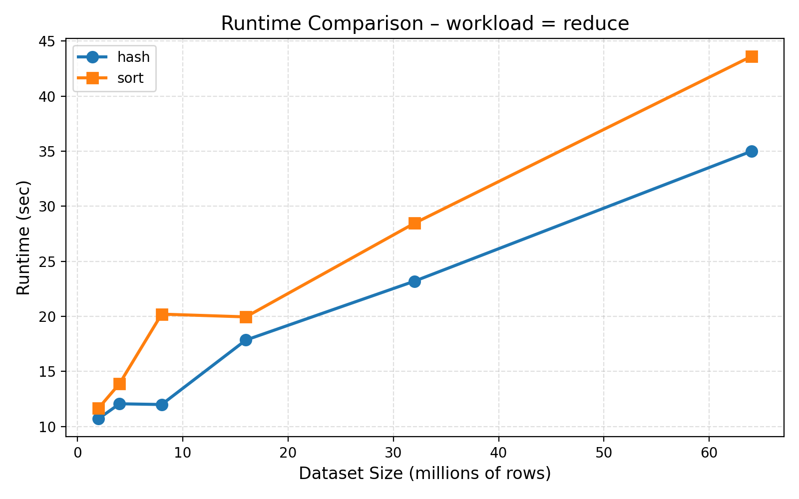
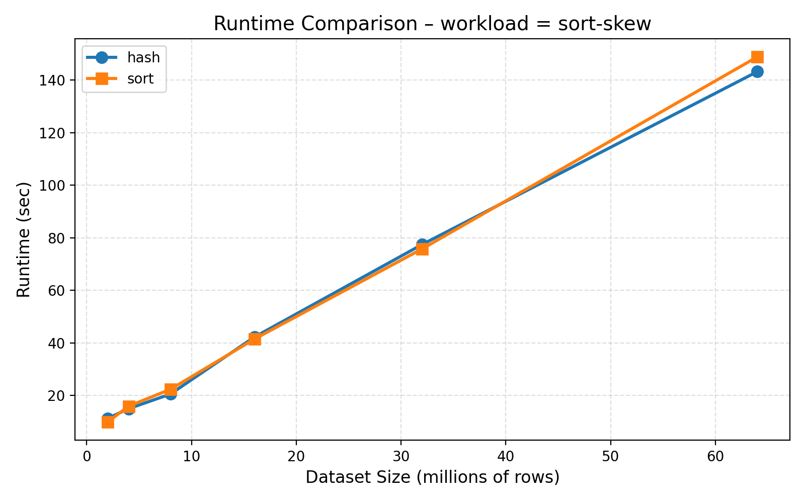
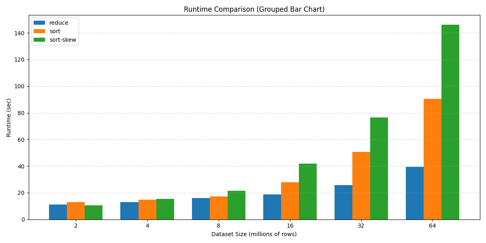
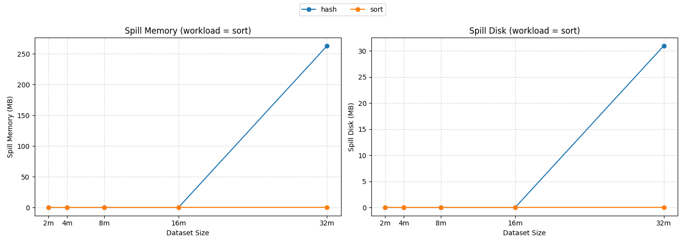
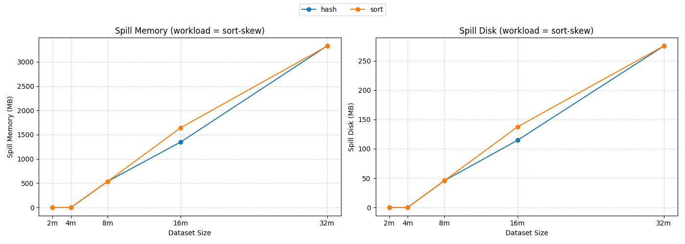

# Spark Shuffle算法比较

## 研究目的

比较Spark中的两种Shuffle算法：基于Hash和基于Sort。

## 研究内容

对比分析Spark中基于Hash和基于Sort的两种Shuffle算法的执行流程，探讨它们各自的优缺点及适用场景。

## 实验

### 实验环境

#### 1. 硬件环境

本实验采用火山引擎（Volcengine）ECS 集群，共包含三台实例（1 台 Master，2 台 Worker），均为 ecs.g3il.large 规格，配置如下：

**（1）计算资源**

- CPU：**2 vCPU**
- 内存：**8 GiB**

**（2）存储资源**

- 系统盘：**极速型 SSD PL0，20 GiB**
- 虽然虚拟机层 `lsblk` 显示 ROTA=1（旋转介质），但根据火山云配置，底层实际使用 SSD，因此磁盘 IO 延迟较低，有利于 Shuffle 阶段的磁盘读写性能。

**（3）网络配置**

- 外网带宽：**1 Mbps**（实例限速）
- 内网带宽：**约 1 Gbps**（火山云 VPC 虚拟交换机）
- Shuffle 过程中节点间通信主要通过内网完成，因此内网带宽对性能影响更为关键。

**（4）节点列表**

| 角色       | 实例类型           | CPU    | 内存    | 系统盘            | 操作系统         |
| -------- | -------------- | ------ | ----- | -------------- | ------------ |
| Master   | ecs.g3il.large | 2 vCPU | 8 GiB | SSD PL0 20 GiB | Ubuntu 22.04 |
| Worker 1 | ecs.g3il.large | 2 vCPU | 8 GiB | SSD PL0 20 GiB | Ubuntu 22.04 |
| Worker 2 | ecs.g3il.large | 2 vCPU | 8 GiB | SSD PL0 20 GiB | Ubuntu 22.04 |

---

#### 2. 软件环境

**（1）操作系统**

- Ubuntu **22.04.4 LTS**

**（2）Java 环境**

- OpenJDK **1.8.0_472**

**（3）Spark 版本**

- Spark **1.6.3** (Standalone 模式)

**（4）Python 环境**

- Python **3.10.12**

---

#### 3. 节点角色与服务分布

| 节点 IP      | 主机名          | 角色     | 运行服务            |
| ---------- | ------------      | ------ | --------------- |
| 172.31.0.2 | spark-master      | Master | Master |
| 172.31.0.3 | spark-worker1     | Worker | Worker          |
| 172.31.0.4 | spark-worker2     | Worker | Worker          |

---

#### 4. Spark 资源配置

| 项目            | 数值      |
| ------------- | ------- |
| Worker CPU 核数 | 2 cores |
| Worker 内存     | 4 GB    |
| Shuffle 服务端口  | 7337    |
| Spark UI 端口   | 8080    |

### 实验负载

#### 1. 数据集说明

本实验采用自定义脚本生成结构化 CSV 数据集，每条记录由三列整数组成：

```
id,rand1,rand2
```

其中：

- `id`: 从 0 递增，可作为排序场景的 key；
- `rand1`: 0～1,000,000 的均匀随机整数，主要用于 reduce 工作负载；
- `rand2`: 被人为构造为高度倾斜，用于验证 Spark Shuffle 在数据倾斜场景下的行为。

这样设计的目的是：

- 普通负载（reduce / sort）可在无倾斜干扰下对比 Hash 与 Sort Shuffle 的差异；
- 倾斜负载可观测 Hash Shuffle 的退化现象，以及 Sort Shuffle 在倾斜下的性能变化。

根据实验需求，生成了六个不同规模的数据集，分别包含 2M、4M、8M、16M、32M、64M 条记录，文件大小从约 41MB 到 1.4GB 不等：

| 数据集名称         | 行数          | 文件大小 |
| ------------- | ----------- | ------- |
| data_2m.csv   | 2,000,000   | 41 MB  |
| data_4m.csv  | 4,000,000  | 83 MB  |
| data_8m.csv  | 8,000,000  | 166 MB  |
| data_16m.csv  | 16,000,000  | 337 MB  |
| data_32m.csv | 32,000,000 | 685 MB  |
| data_64m.csv | 64,000,000 | 1.4 GB  |

为了保证 Worker 节点能够本地访问数据，所有数据集均被分发到 Spark Standalone 集群的所有节点（Master + Worker）相同路径 `/home/spark/data` 下。

---

#### 2. 工作负载

为了对比 Hash Shuffle 与 Sort Shuffle 在不同场景下的表现，本实验设计了三类典型的 Shuffle-heavy 工作负载：

- reduce：均匀聚合型 Shuffle
- sort：均匀排序型 Shuffle
- sort-skew：带数据倾斜的排序型 Shuffle

三类 workload 的核心代码都封装在同一个 `ShuffleTest` 程序中，通过命令行参数指定 `shuffleManager`（hash / sort）和 `workload`（reduce / sort），再配合不同的数据集文件来触发对应场景。

---

**（1）聚合类工作负载：reduceByKey**

该 workload 用于测试在 **key 均匀分布** 情况下，reduceByKey 聚合引发的 Shuffle 行为。

处理流程如下：

```scala
val data = sc.textFile(input)
val pairs = data.map { line =>
    val arr = line.split(",")
    (arr[1].toInt, 1)      // 使用 rand1 作为 key，保证 key 分布均匀
}
val result = pairs.reduceByKey(_ + _)
result.saveAsTextFile(output)
```

这样处理的特点是：

- `reduceByKey` 会对相同 key 的 value 进行聚合；
- 会触发 Shuffle，将相同 key 的记录移动到同一 Reducer；
- 使用 CSV 中均匀分布的 `rand1` 作为 key，可有效避免数据倾斜。

---

**（2）排序类工作负载：sortBy**

该 workload 测试 **全局排序** 在无倾斜条件下的 Shuffle 行为。

处理流程：

```scala
val data = sc.textFile(input)
val sorted = data.sortBy { line =>
    line.split(",")(0).toInt   // 按 id 排序
}
sorted.saveAsTextFile(output)
```

这样处理的特点是：

- `sortBy` 必然触发全局 Shuffle，将所有记录重新分布到有序分区；
- 数据均匀，分区负载较均衡；
- 用于对比 hash/sort 在标准排序场景下的差异。

---

**（3）数据倾斜负载：sort-skew**

为观察 Shuffle **在严重数据倾斜场景下** 的表现，我们使用 CSV 中的第三列（`skew_key`）作为聚合 key，其中多数记录具有相同 key，从而人为制造数据倾斜：

```scala
val sorted = data.sortBy { line =>
  val arr = line.split(",")
  arr(2).toInt          // 第三列：专门造倾斜
}
sorted.saveAsTextFile(outputPath)
```

特点：

- 仍然是排序类 workload（sortBy）；
- 但排序 key 的分布极度不均匀，会造成分区倾斜；
- 该 workload 会分别跑 `Hash Shuffle` 和 `Sort Shuffle`，用于比较两种 Shuffle 在倾斜场景下的稳定性。

#### 3. Shuffle 策略测试

我们为上述三个 workload 分别测试：

- Hash Shuffle + reduce
- Sort Shuffle + reduce
- Hash Shuffle + sort
- Sort Shuffle + sort
- Hash Shuffle + sort-skew
- Sort Shuffle + sort-skew

这六种组合覆盖了 Spark 中常见的 Shuffle 场景。

## 实验步骤

本实验基于三节点 Spark Standalone 集群（1 Master + 2 Worker）完成。实验主要包括：环境部署、数据集生成、测试程序打包、分布式作业运行以及结果记录。关键步骤如下：

### 1. 部署 Spark Standalone 集群

在三台云服务器上安装 JDK 1.8 与 Spark 1.6.3，并配置 Master 与 Worker 的启动脚本。

- 在 master 节点执行：

```bash
$ jps
6944 Jps
1575 Master
```

- 在 worker1 节点执行：

```bash
$ jps
3558 Jps
1177 Worker
```

- 在 worker2 节点执行：

```bash
$ jps
1178 Worker
3563 Jps
```

如下图所示：


Spark 集群启动成功后，可通过浏览器访问 Spark UI：

```
ssh -L 18081:localhost:8080 spark-master
http://localhost:18081
```

打开后可以看出集群已成功部署：


---

### 2. 生成不同规模的数据集

为评估 Spark Shuffle 在不同数据规模下的性能表现，本实验使用 Python 脚本自动生成六份不同大小的 CSV 数据集。每条记录由三列组成：`id（递增）`、`value（随机）`、`skew_key（用于模拟数据倾斜）`。

数据通过统一的生成脚本批量生成。例如，以下命令用于生成 800 万条记录的数据集：

生成脚本示例：

```bash
python3 generate.py 8000000 /home/spark/data/data_8m.csv
```
为了便于实验自动化，本实验进一步编写了批处理脚本（generate.sh），可一次性生成全部 6 个数据集：

```bash
./generate.sh
```

生成的数据集最终统一存放在目录：

```
/home/spark/data/
```


---

### 3. 编写并打包 Shuffle 测试程序

本实验的核心测试程序 ShuffleTest 使用 Scala 编写，主要用于在不同 ShuffleManager（Hash / Sort）下执行三类 Shuffle-heavy 工作负载：

- reduce：使用 `reduceByKey` 测试聚合类 Shuffle
- sort：使用 `sortBy` 测试均匀分布条件下的全局排序
- sort-skew：使用 `sortBy` 对倾斜字段排序，用于测试数据倾斜场景下的 Shuffle 行为

程序入口根据命令行参数自动选择 ShuffleManager 与 workload 类型，并为每次运行生成可读性非常强的应用名称：

```
ShuffleTest-[shuffleManager]-[workload]-[datasetSize]
```

例如：

- `ShuffleTest-hash-reduce-8m`
- `ShuffleTest-sort-sort-32m`
- `ShuffleTest-hash-sort-skew-64m`

清晰标识了当前运行的 Shuffle 类型、工作负载类型与数据集规模，便于后续日志分析与结果对比。


程序使用 sbt 进行构建。在项目根目录执行：

```bash
./build.sh
```

脚本会自动调用：
```
sbt package
```

成功构建后，JAR 文件会生成在：
```
target/scala-2.10/shuffle-test_2.10-0.1.jar
```


---

### 4. 运行 run_all.sh 自动化实验脚本

为了避免手动多次提交作业，本实验使用统一的自动化脚本 run_all.sh 来一次性执行所有 Shuffle 组合测试。脚本会覆盖：

- Shuffle Manager：`hash`、`sort`
- Workload 类型：`reduce`、`sort`、`sort-skew`
- 数据集规模：`2m`, `4m`, `8m`, `16m`, `32m`, `64m`

脚本示例：

```bash
./run_all.sh
```

脚本会依次提交 36 个实验任务，并将输出写入：

```
/home/spark/results/
```

运行过程如下：


---

### 5. 查看作业执行情况

所有作业执行完成后，可在 Spark History Server 查看任务执行情况：

访问地址：

```
http://localhost:18081/
```

在 Completed Applications 页面可看到如下任务名称：

```
ShuffleTest-hash-reduce-8m
ShuffleTest-sort-sort-16m
ShuffleTest-hash-sort-skew-32m
...
```


可以看到均显示为：

```
State: FINISHED
```

---

### 6. 检查输出结果是否正确生成

在每次 Shuffle 实验结束后，Spark 会在输出目录写入一个特殊标记文件 `_SUCCESS`，用于表示作业已完整执行并成功结束。

使用以下命令检查所有结果目录的执行状态：

```bash
for d in /home/spark/results/*; do
  echo "$d:"
  if [ -f "$d/_SUCCESS" ]; then
    echo "Job completed successfully (_SUCCESS found)"
  else
    echo "Missing _SUCCESS (job may have failed)"
  fi
done

```


运行结果显示，所有实验目录均包含 `_SUCCESS` 文件，表明所有 Shuffle 任务均已完整执行，为后续解析 Spark Event Log 获取性能指标（运行时间、Shuffle I/O、Spill、CPU/GPU 时间等）提供了可靠依据。

---

## Spark Hash Shuffle 与 Sort Shuffle 的核心差异对比

- Hash机制


- Sort机制


### 1. 核心机制差异
| 维度                | Hash Shuffle                          | Sort Shuffle                          |
|---------------------|---------------------------------------|---------------------------------------|
| **文件数量**        | 生成 M×R 个文件（M=Map数，R=Reduce数），文件数随任务数剧增 | 仅生成 2×M 个文件（每个Map对应1个数据文件+1个索引文件） |
| **Map端排序**       | 无排序操作，直接按Hash分桶写文件       | 强制对数据排序      |
| **内存数据结构**    | 仅用内存缓冲，满后直接溢写磁盘         | 用Map/Array存储数据，溢写前排序+合并   |
| **文件合并逻辑**    | 仅支持Consolidate（非稳定），减少部分文件 | 自动合并临时文件为1个数据文件+索引文件 |

---

### 2. 性能与适用场景差异
| 维度                | Hash Shuffle                          | Sort Shuffle                          |
|---------------------|---------------------------------------|---------------------------------------|
| **优势场景**        | 无需排序的小数据场景（省去排序开销）   | 大规模数据场景（文件数可控，稳定性高） |
| **性能瓶颈**        | 小文件过多导致磁盘/内存压力大          | 强制排序带来额外CPU/内存开销 |
| **扩展性**          | 数据量增大时文件爆炸，无法扩展         | 支持海量数据，集群扩展能力强           |

---

## 实验结果与分析

基于上述实验步骤，我们对生成的不同规模的数据集进行了 Hash Shuffle 与 Sort Shuffle 的各种性能对比。

### 1. 执行时间分析 (Execution Time)

本实验在不同规模（2M–64M）的数据集上，对 Hash Shuffle 与 Sort Shuffle 在三类工作负载（reduce、sort、sort-skew）下的运行时间进行了测试，并绘制了相应的趋势图与分组柱状图。从图中可以观察到如下规律与差异。

**(1) reduce 工作负载：Hash Shuffle 始终快于 Sort Shuffle**



在 reduceByKey 场景中，shuffle 的核心操作是“按 key 聚合”。实验结果显示：

- Hash Shuffle 全程运行时间更低，优势随数据规模扩大而更加明显；
- 在数据量较小（2M–8M）时，两者差异不大；
- 当规模提升至 64M，Hash Shuffle 仅约 35s，而 Sort Shuffle 约 44s，性能差距达到 25% 以上。

原因分析：
- ReduceByKey 主要依赖“按 key 分桶 + 聚合”，无须排序；
- Hash Shuffle 直接通过哈希分区得到目标分组，开销更小；
- Sort Shuffle 引入了额外的排序与归并步骤，因此在该类 workload 下不占优势。

**(2) sort 工作负载：Hash 与 Sort Shuffle 性能几乎一致**


在对 id 进行全局 sortBy 时：

- Hash Shuffle 与 Sort Shuffle 的运行曲线几乎重合；
- 随数据规模线性增长，但两者差距通常小于 5%；

原因分析：

- SortBy 本质是全局排序任务，其主导成本是 排序开销；
- 无论使用 Hash 还是 Sort Shuffle，最终都需要经过多次排序与合并；
- 因此 Shuffle 类型对该 workload 的影响非常有限。

**(3) sort-skew 工作负载：数据倾斜导致性能急剧恶化**



在 skew 版本的 sortBy 工作负载中：

- 运行时间随数据规模急剧上升，增长速度远超前两类 workload；
- 在 64M 时，排序运行时间达到 145 秒以上，比正常 sort 版本高出 约 60%+；
- Hash 与 Sort Shuffle 在倾斜场景下表现非常接近，二者差异不大。

原因分析：

- sort-skew 通过倾斜 key 的分布，导致某些 Task 接收了远多于其它 Task 的数据；
- 即便 ShuffleManager 不同，极端倾斜都会导致单点 Task 变成全局瓶颈；
- Sorting 是 CPU 密集型操作，面对数倍以上的数据量，耗时呈线性甚至超线性上升。


**(4) 分组柱状图总结三类 workload 的整体趋势**



综合所有数据规模后：

- reduce 工作负载最轻量，运行时间最短（10–40s）；
- sort 工作负载居中（12–90s），并与 shuffle 类型无强相关；
- sort-skew 最重（10–145s），在大数据集上成为性能瓶颈；
- 工作负载差异远大于 Shuffle 算法差异。

这表明：

- 工作负载类型（是否存在排序、是否存在数据倾斜）决定主要性能差异；
- Shuffle 算法（Hash vs Sort）只在 reduce 工作负载下产生明显影响。

---

### 2. Shuffle I/O 数据量分析

为了深入理解性能差异的来源，我们进一步分析了 Shuffle 过程中的磁盘写（Write）和读（Read）的数据量。

#### 2.1 Shuffle Read 数据量：整体呈现线性随数据规模增长


在 Shuffle Read 可视化结果中可以观察到以下现象：

**(1) sort-sort / sort-sort-skew 的 Shuffle Read 量显著高于其他组合**

- 两条曲线（紫色、棕色）随着数据规模呈近似线性增长，最大读量接近 **950 MB**。
- 且 hash-sort 与 sort-sort 的读量几乎完全重叠，说明：

  - 在全局排序类 workload 中，Shuffle 数据量主要由排序算法本身决定，而非 ShuffleManager。
- 对于 sort-skew，Shuffle Read 量也呈线性，但略低于 sort-sort。

**(2) reduce 类工作负载的 Shuffle Read 明显更小**

- 无论 hash-reduce 或 sort-reduce，都呈现明显低于 sort / sort-skew 的读量，最大约 **200 MB 左右**。
- reduce 工作负载只对 key 进行聚合，其 shuffle 数据量主要受 key 分布和 reducer 数影响，而不是全量排序。

**(3) hash 与 sort 在 reduce 与 sort-skew 上差异很小**

- 在 reduce、sort-skew 两类 workload 中，Hash Shuffle 与 Sort Shuffle 的 read 数据量几乎重合。
- 表明在这些场景下，Spark 的 ShuffleManager 类型不会改变读入数据的规模。

---

#### 2.2 Shuffle Write 数据量：与 Read 的趋势基本一致


Shuffle Write 的图像与 Shuffle Read 的趋势高度一致，表明 Shuffle 的输入输出规模整体对称：

**(1) sort-sort、sort-sort-skew 写出量最大**

- 最大写出量同样接近 **950 MB**。
- 线性变化趋势明显，与数据规模几乎成正比。

**(2) reduce 类任务写出量最小**

- 最高约 **180–200 MB**。
- 尤其在小数据集上，写出量非常小，符合 reduce 操作的局部聚合特性。

**(3) hash 与 sort 的差异同样非常接近**

- 除个别点因插值导致略微偏移外，两者在所有 workload 的写出规模上几乎重叠。
- 提示 ShuffleManager 类型对数据规模本身影响不大，更主要影响 I/O 行为与磁盘使用方式。

---

#### 2.3. sort / sort-skew 远大于 reduce

从结果可观察到：

- 全局排序（sort）与倾斜排序（sort-skew）的 Shuffle 数据量均远高于 reduce。
- 数据倾斜（skew）并未显著增加 Shuffle 数据量，但会导致运行时间增加（前面时间分析部分已显示）。

这说明不同 workload 的 Shuffle 逻辑导致了不同的数据重分布规模，而 ShuffleManager（hash/sort）本身并不会改变 Shuffle 数据量的大小。

---

### 3. Shuffle Spill 实验结果与分析

接下来进一步从 Shuffle Spill 的角度，对比分析 Hash Shuffle 与 Sort Shuffle 在不同数据规模和不同 workload 下的资源使用情况。Spill 是指当 shuffle 过程需要的内存超过阈值时，Spark 会将部分中间数据写入磁盘或以溢出的方式进行管理，因此其发生情况与 shuffle 算法的内存模式密切相关。

本实验主要观测两个指标：

- Shuffle Spill (Memory)：溢写到内存的中间数据量
- Shuffle Spill (Disk)：溢写到磁盘的中间数据量

#### 3.1 reduce workload：Hash 与 Sort 均无 Spill


在 `reduce` workload 中，无论采用 Hash Shuffle 还是 Sort Shuffle，所有数据规模下的 Memory Spill 和 Disk Spill 均为 0。

这一现象说明：

- reduce 工作负载在实现上不依赖 shuffle 大量聚合键值；
- 分区数量适配内存配置，执行过程中不会出现内存压力导致的溢写行为。

#### 3.2 sort workload：Hash Shuffle 在大数据规模下出现显著 Spill



在 `sort` workload 中，Sort Shuffle 在所有规模下均 没有发生 Spill（memory/disk 均为 0 MB）。

相比之下，Hash Shuffle 在大数据规模（尤其是 16m、32m）中出现明显 Spill：

- 16m 数据规模出现约 260 MB 级别的 Memory Spill 与 31 MB Disk Spill
- 32m 数据规模上进一步扩大至约 270 MB Memory Spill / 31 MB Disk Spill

这表明 Hash Shuffle 在排序相关 workload 中的内存占用更高。当数据规模增大时，其内存结构（基于 hash 分桶）导致溢写，而 Sort Shuffle 因为使用外排序模式，能够将中间结果有序写入磁盘，其内存压力更小。

#### 3.3 sort-skew workload：Hash 与 Sort 均出现大规模 Spill



在 skew（数据倾斜）场景下，两种 shuffle 策略都发生了明显的 Spill，但表现不同：

**Sort Shuffle**
- Memory Spill 随数据规模线性增长，从约 520 MB（8m）到 3300 MB（32m）
- Disk Spill 也持续增长，从约 45 MB 到约 280 MB

**Hash Shuffle**

- 8m 时与 Sort 数值完全一致
- 16m 时 Memory Spill 略低于 Sort（约 1349 MB vs 1645 MB）
- 32m 时两者几乎一致（3300 MB 级别）

整体来看，在高倾斜场景下无论使用 Hash 还是 Sort Shuffle，都需要处理大量不均匀 key 的 shuffle 数据，因此 Spill 成为必然现象。

两者的数值非常接近，说明数据倾斜对 Shuffle 行为的影响压过了算法本身的结构差异。


## 实验结论

通过在不同数据规模和不同工作负载（reduce、sort、sort-skew）下对 Hash Shuffle 与 Sort Shuffle 的执行时间、Shuffle I/O 数据量以及 Shuffle Spill 行为进行系统性测试，可以得出如下总体结论：

首先，**Shuffle 的性能主要受到工作负载特性的影响，而非 Shuffle 算法本身。** 在 reduce 类任务中，由于仅需按 key 聚合、无需排序，Hash Shuffle 能以更低的 CPU 与 I/O 开销完成计算，因此表现出显著的性能优势。相应地，Hash Shuffle 更适用于聚合型工作负载（如 reduceByKey、aggregateByKey），尤其在数据规模进一步增大时，其优势更加突出。

其次，**在排序类任务中（sort 工作负载），Hash Shuffle 与 Sort Shuffle 的性能几乎一致。** 这是因为全局排序的主要成本来自排序过程本身，而非 Shuffle 管理方式，因此 ShuffleManager 对执行时间与 Shuffle 数据量的影响被弱化。在此类任务中，Sort Shuffle 的外排序机制能够保持较低的内存压力，因此更适合 大规模排序任务（如 sortBy、orderBy），具有更稳定的执行特性。

再次，**在数据倾斜场景（sort-skew）下，两种 Shuffle 都出现了显著的性能退化。** 无论使用 Hash Shuffle 或 Sort Shuffle，运行时间、Spill 行为均大幅增加，且二者差异极小。这说明性能瓶颈完全源自数据倾斜本身，而非 Shuffle 算法选择。因此在此类场景中，应优先考虑 缓解数据倾斜的策略（如加盐、重新分区、map-side 聚合等），而不是依赖 ShuffleManager 的切换。

综合上述实验结果，可以给出如下适用场景建议：

- `Hash Shuffle`： 适用于无需排序、需要高效分组与聚合的任务，是 reduceByKey 等聚合型 workload 的最优选择。
- `Sort Shuffle`： 更适合带有全量排序需求或大规模 Shuffle 的场景，其内存溢写更可控、执行更稳定。
- 两者均难以改善的场景： 对于存在严重 key 倾斜的任务，Shuffle 算法差异被倾斜效应掩盖，需要从数据分布角度进行优化。

总体而言，Shuffle 算法的选择应基于任务类型而非单一性能指标：聚合选 Hash，排序选 Sort；若出现倾斜，则应优先治理倾斜本身。

   
---

## 分工

52305903003 文羽昕：实验环境部署、参数切换、运行 Spark 任务 25%

51285903047 赵欣雨：理论部分:shuffle 原理、Hash vs Sort、撰写分析与结论 25%

51285903121 季润民：数据收集、绘图、最后整合报告 25%

51285903122 樊骁斌：制作汇报PPT与答辩视频 25%


